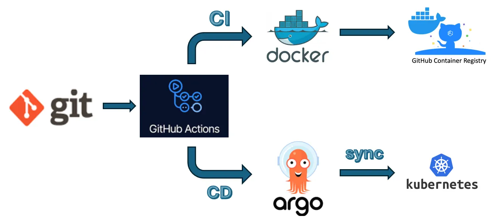
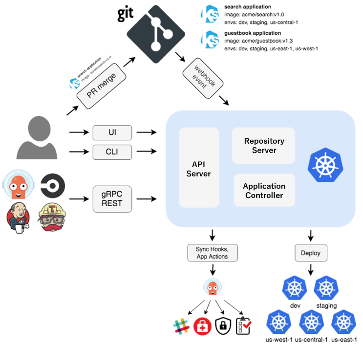
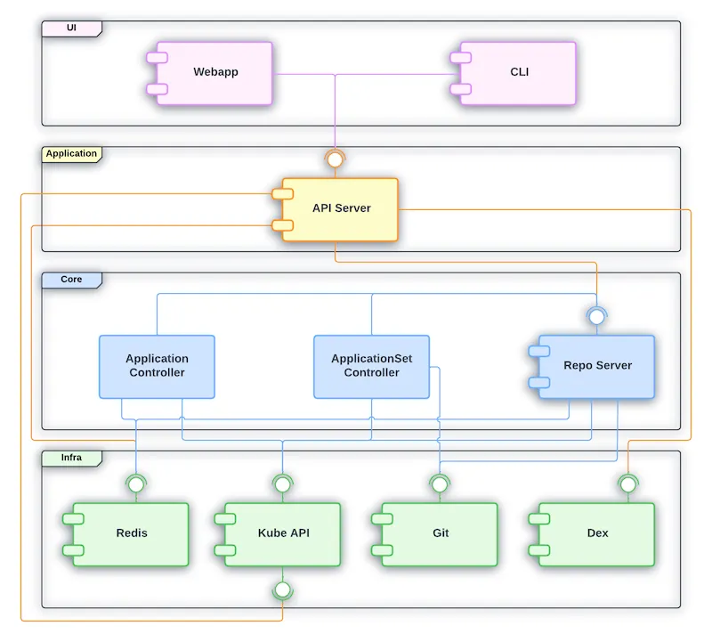
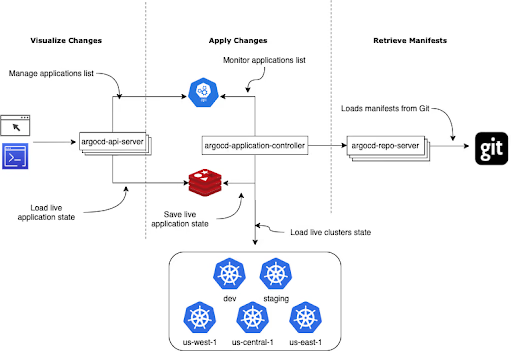
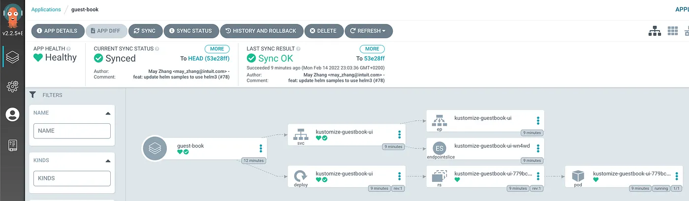
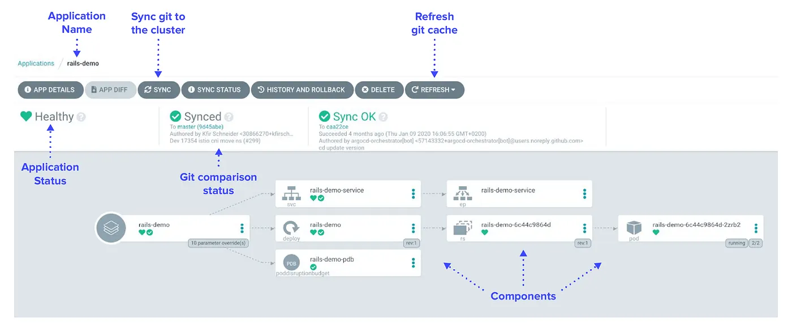

# ArgoCD-GitHub-Actions
Build a Secure AWS EKS CI/CD Pipeline: Step-by-Step Tutorial (ArgoCD + GitHub Actions)

## Commands
```sh
cd envs/global/s3
terraform init
terraform apply -var-file=../global.tfvars
terraform init -migrate-state -backend-config=../state.config
cd ../iam
terraform init -backend-config=../state.config
terraform apply -var-file=../global.tfvars
cd ../ecr
terraform init -backend-config=../state.config
terraform apply -var-file=../global.tfvars
git commit --allow-empty -m "trigger ci/cd"
git push origin main
cd ../../dev/vpc/
terraform init -backend-config=../state.config
terraform apply -var-file=../dev.tfvars -var-file=vpc.tfvars
cd ../eks
terraform init -backend-config=../state.config
terraform apply -var-file=../dev.tfvars -var-file=eks.tfvars
aws eks update-kubeconfig --name dev-main --region us-east-1
kubectl get pods -A
kubectl -n argocd get secret argocd-initial-admin-secret -o jsonpath="{.data.password}" | base64 -d
kubectl port-forward svc/argocd-server 8080:80 -n argocd
ssh-keygen -t ed25519 -C "aputra@antonputra.com" -f ~/.ssh/argocd_ed25519
cd ../../..
kubectl apply -f k8s/repo-secret.yaml
kubectl apply -f k8s/application.yaml
kubectl get pods -n my-app
kubectl get pods -n my-app -o wide
dig k8s-myapp-myapp-a6d50e5e0c-2ce465b175ee5624.elb.us-east-1.amazonaws.com
curl -i http://k8s-myapp-myapp-b6d0d28cfe-57e6e2d80218d4d4.elb.us-east-1.amazonaws.com:8080/version
kubectl get pods -n my-app
for i in `seq 1 100000`; do curl -m 10 http://k8s-myapp-myapp-b6d0d28cfe-57e6e2d80218d4d4.elb.us-east-1.amazonaws.com:8080/version; sleep 1; done
git commit --allow-empty -m "trigger ci/cd"
git push origin main
kubectl get pods -n argocd
kubectl logs -f argocd-application-controller-0 -n argocd
```


ArgoCD implements a GitOps workflow, using a GitHub repository as the single source of truth for your application's desired state on a Kubernetes (K8s) cluster.


### The GitOps Workflow with ArgoCD

ArgoCD is installed as a controller inside your Kubernetes cluster. It continuously monitors a Git repository (like one on GitHub) for changes to Kubernetes manifest files (YAML, Helm charts, Kustomize, etc.) and automatically synchronizes the cluster's actual state to match the declared desired state in Git.


### GitHub as the Source of Truth

- A Git repository (on GitHub, GitLab, etc.) holds all your application's Kubernetes manifests (deployments, services, ingress, etc.). This repository defines the desired state.
- When a developer makes a change (e.g., updating an image tag or a replica count) and merges the pull request to the main/target branch, this commit represents the new desired state


### ArgoCD Monitoring and Detection

- The ArgoCD Application Controller runs inside your K8s cluster and is configured to monitor the specific GitHub repository and branch/path containing the manifest files.

- It periodically polls the Git repository for changes, or a webhook from GitHub can instantly notify ArgoCD of a new commit


### Synchronization and Deployment

ArgoCD compares the desired state (the manifests in GitHub) with the live state (the current resources running in the K8s cluster).

If a difference is detected (the application is OutOfSync), ArgoCD takes action based on its synchronization policy:
  - Manual Sync: A user triggers the deployment via the ArgoCD UI or CLI.
  - Automatic Sync: ArgoCD automatically applies the necessary changes to the Kubernetes API to reconcile the cluster state with the Git state, deploying or updating the application


  GitHub Actions and ArgoCD work together by separating the Continuous Integration (CI) pipeline from the Continuous Delivery (CD) process, adhering to the core tenets of GitOps.

GitHub Actions handles the CI tasks, while ArgoCD handles the CD synchronization and reconciliation.

GitHub Actions is triggered by a commit to the application code repository (e.g., a merge to the main branch). Its primary role is to create the application artifact and update the GitOps repository.


Step	Action	Description
1. Build & Test	GitHub Actions	Compiles the source code, runs unit and integration tests, and lints the code.
2. Image Creation	GitHub Actions	Builds the Docker/Container Image and tags it, typically with the Git commit SHA or a semantic version.
3. Image Push	GitHub Actions	Pushes the newly tagged image to a Container Registry (e.g., Docker Hub, GHCR).
4. Manifest Update	GitHub Actions	Crucially, it updates the image tag within the Kubernetes manifest files (or Helm values.yaml, Kustomize file, etc.) in a separate GitOps repository.
5. Commit & Push	GitHub Actions	Commits and pushes the updated manifest file to the GitOps repository. This commit is the trigger for the CD phase.


### ArgoCD (CD/Deployment)

ArgoCD monitors the GitOps Repository (the one that GitHub Actions just updated).
Step	Action	Description
1. Detection	ArgoCD Controller	Detects the new commit in the GitOps repository, noting the change in the image tag.
2. Comparison	ArgoCD Controller	Compares the desired state (the new manifests in Git) with the live state (the current resources in the K8s cluster).
3. Synchronization	ArgoCD Controller	Automatically (or manually, depending on the sync policy) applies the changes to the Kubernetes cluster. This deployment pull the new container image specified by the updated tag.
4. Reconciliation	ArgoCD Controller	Continuously monitors the cluster, ensuring the cluster's actual state remains synchronized with the desired state defined in the GitOps repository.





The goal is to automate the deployment pipeline such that:

- Your application is built with GitHub Actions.
- Docker images are pushed to GitHub Container Registry (GHCR).
- ArgoCD detects the updated image tag in your GitOps repository and syncs the Kubernetes manifests accordingly

### Architecture Overview

1. CI Pipeline with GitHub Actions
— Build the application.
— Tag and push the Docker image to GHCR.
— Update the image tag in the GitOps repository.
    
2. GitOps Repository
— Contains Kubernetes manifests managed by ArgoCD.
— ArgoCD syncs changes to kubernetes automatically or manually based on configuration.
3. ArgoCD
— Monitors the GitOps repo.
— Reconciles the desired state (Git) with the live state (Kubernetes).

### Prerequisites
- Kubernetes cluster configured and running
- ArgoCD installed on the kubernetes cluster
- A GitHub repository for your application code (CI repo)
- A separate GitHub repository for your Kubernetes manifests (GitOps repo)
- GitHub Container Registry enabled
- kubectl and ArgoCD CLI configured locally

#### Install ArgoCD on Your Kubernetes Cluster Using Helm

To begin, we’ll deploy ArgoCD on our existing Kubernetes cluster using the official Helm chart. This will set up the GitOps controller that continuously reconciles the state between your Git repository and the cluster.

#### Create an ImagePullSecret in the Application Namespace to Access Private Images

Since our repository is private, the container images pushed to GitHub Container Registry (GHCR) are also private by default. To allow Kubernetes to pull these images, we need to create a docker-registry type secret in the application’s namespace.


```sh
kubectl create secret docker-registry ghcr \
  --docker-server=ghcr.io \
  --docker-username=<your-github-username> \
  --docker-password=<your-personal-access-token> \
  --namespace=<your-app-namespace>
```

Argo CD is a pull-based CI/CD system. It runs inside your Kubernetes cluster and pulls source from your repositories. Argo then applies the changes for you without a manually configured pipeline.

This model is more secure than push-based workflows. You don’t have to expose your cluster’s API server or store Kubernetes credentials in your CI/CD platform. Compromising a source repository only gives an attacker access to your code instead of the code and a route to your live deployments.

Key features of Argo CD include:
* GitOps-based deployment – Uses Git as the single source of truth, enabling declarative configuration and automated syncing with Kubernetes clusters
* Declarative application definitions – Supports `Helm, Kustomize, Jsonnet, and plain YAML` to define and manage application manifests
* Automated synchronization – Automatically syncs Kubernetes resources with Git repositories, ensuring cluster state matches the desired state
* Real-time application status monitoring – Continuously monitors app health and sync status, with visual dashboards and diff views
* Role-based access control (RBAC) – Fine-grained access controls for managing user permissions across projects and environments
* Multi-cluster support – Manages deployments across multiple Kubernetes clusters from a single Argo CD instance
* Web UI and CLI– Provides a user-friendly web interface and CLI for managing applications, viewing diffs, and troubleshooting


Argo CD core concepts

Argo CD is easy to learn once you understand its basic concepts. Here are the core elements of Argo CD architecture:

- Application controller – Argo’s Application Controller is the component you install in your cluster. It implements the Kubernetes controller pattern to monitor your applications and compare their state against their repositories.
- Application – An Argo application is a group of Kubernetes resources that collectively deploy your workload. Argo stores the details of applications in your cluster as instances of an included Custom Resource Definition (CRD).
- Live state – The live state is your application’s current state inside the cluster, such as the number of Pods created and the image they’re running.
- Target state – The target state is the version of the state declared by your Git repository. When the repository changes, Argo will apply actions that evolve the live state into the target state.
- Refresh – A refresh occurs when Argo fetches the target state from your repository. It compares the changes against the live state but doesn’t necessarily apply them at this stage.
- Sync – A Sync is the process of applying the changes discovered by a Refresh. Each Sync moves the cluster back toward the target state.
- API server – The Argo API server provides the REST and gRPC API interface used by the CLI, Web UI, and external integrations.
- Git repository – The Git repository acts as the single source of truth, storing declarative configurations for all applications and environments.

[argocd](https://spacelift.io/blog/argocd)


- A developer issues a pull request, changing Kubernetes manifests, which are created either manually or automatically.
- The pull request is reviewed and changes are merged to the main branch. This triggers a webhook which tells Argo CD a change was made.
- Argo CD clones the repo and compares the application state with the current state of the Kubernetes cluster. It applies the required changes to cluster configuration.
- Kubernetes uses its controllers to reconcile the changes required to cluster resources, until it achieves the desired configuration


## Why Argo CD?
Application definitions configurations, and environments should be declarative and version controlled. Application deployment and lifecycle management should be automated, auditable, and easy to understand.

### How it works

Argo CD follows the GitOps pattern of using Git repositories as the source of truth for defining the desired application state. Kubernetes manifests can be specified in several ways:

- kustomize applications
- helm charts
- jsonnet files
- Plain directory of YAML/json manifests
- Any custom config management tool configured as a config management plugin

Argo CD automates the deployment of the desired application states in the specified target environments. Application deployments can track updates to branches, tags, or be pinned to a specific version of manifests at a Git commit

## Architecture


Argo CD is implemented as a Kubernetes controller which continuously monitors running applications and compares the current, live state against the desired target state (as specified in the Git repo). A deployed application whose live state deviates from the target state is considered `OutOfSync`


## Features

- Automated deployment of applications to specified target environments
- Support for multiple config management/templating tools (Kustomize, Helm, Jsonnet, plain-YAML)
- Ability to manage and deploy to multiple clusters
- SSO Integration (OIDC, OAuth2, LDAP, SAML 2.0, GitHub, GitLab, Microsoft, LinkedIn)
- Multi-tenancy and RBAC policies for authorization
- Rollback/Roll-anywhere to any application configuration committed in Git repository
- Health status analysis of application resources
- Automated configuration drift detection and visualization
- Automated or manual syncing of applications to its desired state
- Web UI which provides real-time view of application activity
- CLI for automation and CI integration
- Webhook integration (GitHub, BitBucket, GitLab)
    Access tokens for automation
- PreSync, Sync, PostSync hooks to support complex application rollouts (e.g.blue/green & canary upgrades)
    Audit trails for application events and API calls
- Prometheus metrics
    Parameter overrides for overriding helm parameters in Git

## Core Concepts

Let's assume you're familiar with core Git, Docker, Kubernetes, Continuous Delivery, and GitOps concepts. Below are some of the concepts that are specific to Argo CD.

- `Application` A group of Kubernetes resources as defined by a manifest. This is a Custom Resource Definition (CRD).
- `Application source type` Which Tool is used to build the application.
- `Target state` The desired state of an application, as represented by files in a Git repository.
- `Live state` The live state of that application. What pods etc are deployed.
- `Sync status` Whether or not the live state matches the target state. Is the deployed application the same as Git says it should be?
- `Sync` The process of making an application move to its target state. E.g. by applying changes to a Kubernetes cluster.
- `Sync operation status` Whether or not a sync succeeded.
- `Refresh` Compare the latest code in Git with the live state. Figure out what is different.
- `Health` The health of the application, is it running correctly? Can it serve requests?
- `Tool` A tool to create manifests from a directory of files. E.g. Kustomize. See Application Source Type.

## ArgoCD Components and Architecture



There are 4 logical layers represented in the diagram:

- UI: This is the presentation layer. Users interact with Argo CD mainly by components from this layer.
- Application: The capabilities required to support the components from the UI layer.
- Core: The main Argo CD gitops functionality is implemented by components and Kubernetes controllers from the Core layer.
- Infra: Represent the tools that Argo CD depends on as part of its infrastructure.


### Webapp
Argo CD ships with a powerful web interface that allows managing applications deployed in a given Kubernetes cluster.
### CLI
Argo CD provides a CLI that can be used by users to interact with Argo CD API. The CLI can also be used for automation and scripting.
### API Server
Defines the proprietary API exposed by Argo CD that powers the Webapp and the CLI functionalities.
### Application Controller
The Application Controller is responsible for reconciling the Application resource in Kubernetes synchronizing the desired application state (provided in Git) with the live state (in Kubernetes). The Application Controller is also responsible for reconciling the Project resource.
### ApplicationSet Controller
The ApplicationSet Controller is responsible for reconciling the ApplicationSet resource.
### Repo Server
Repo Server plays an important role in Argo CD architecture as it is responsible for interacting with the Git repository to generate the desired state for all Kubernetes resources that belongs to a given application.
### Redis
Redis is used by Argo CD to provide a cache layer reducing requests sent to the Kube API as well as to the Git provider. It also supports a few UI operations.
### Kube API
Argo CD controllers will connect to the Kubernetes API in order to run the reconciliation loop.
### Git
As a gitops tool Argo CD requires that the desired state of the Kubernetes resources to be provided in a Git repository.
We use "git" here to stand in for an actual git repo, a Helm repo, or an OCI artifact repo. Argo CD supports all those options.
### Dex
Argo CD relies on Dex to provide authentication with external OIDC providers. However other tools can be used instead of Dex. Check the user management documentation for more details.
Previous 


To authenticate gthub actions with aws, we use OIDC provider and dynamically obtain temporary credentials.. no more static credentials

For argocd to authenticate with AWS ECR,we use port identity to link argocd kubernetes service account with AWS I Am role

Why Argo CD?

- Application definitions, configurations, and environments should be declarative and version controlled.
- Application deployment and lifecycle management should be automated, auditable, and easy to understand.

`GitOps is a set of practices to manage infrastructure and application configurations using Git.`

That means any GitOps operator needs to automate the following steps in sequence:

- Retrieve manifests from Git by cloning the Git repository (e.g. GitHub, GitLab)
- Compare Git manifests with live resources in the Kubernetes cluster using kubectl diff
- Finally use kubectl apply to push changes into the Kubernetes cluster

This is exactly what Argo CD does.




Argo CD Architecture

First, let's take a look at Argo CD architecture. It has three main components: one for each GitOps operator function:

- Argo CD repo server is responsible for cloning the git repository and extracting the Kubernetes resources manifests.
- Argo CD application controller fetches the managed Kubernetes cluster resources and compares the live resources manifests with Git manifests for each application.
- Argo CD API server presents the diffing result (between live manifests and manifests stored in git) to the end user.


ArgoCD will give you the opportunity to version control your cluster deployments, configurations and Kubernetes objects by monitoring a GitHub repository (the source of truth) and applying it to the cluster.



This is for a single application, let’s assume you are working in a microservice architecture, then you will have to create a new ArgoCD application for every microservice, even if you are using tools like kustomize or Helm for sure you will have different values for every deployment which will lead you to create a separate application for each, and as the applications number grows it becomes very hard and doesn’t make any sense to handle that very large number of ArgoCD Applications manifests.

`Here comes ApplicationSet in place, it makes it very easy to automatically create Application manifests using its generators`


